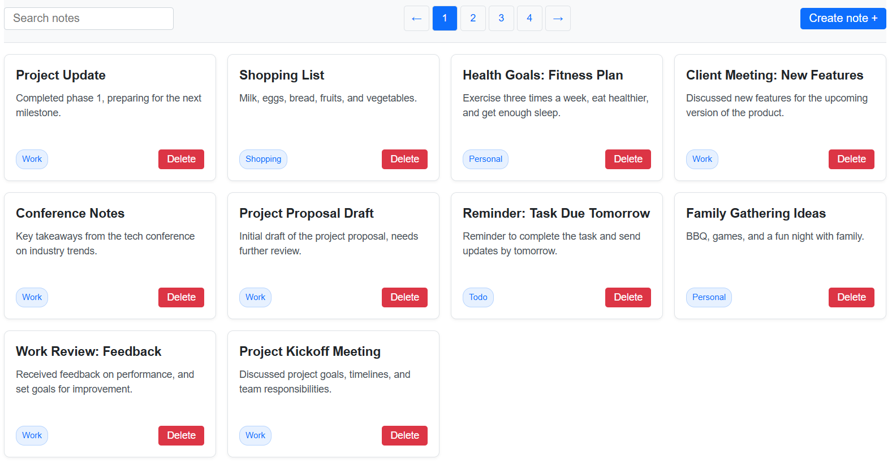

# 📝 NoteHub — Простір для ваших ідей

<p align="center">
  
</p>

---

## 🎯 Про проєкт

📄 **Live Page:**
[Переглянути проєкт](https://05-notehub-green-ten.vercel.app/)

**NoteHub** — це сучасний застосунок для керування нотатками, створений за допомогою React, TypeScript та TanStack Query. Додаток дозволяє створювати, шукати, переглядати та видаляти нотатки через зручний та адаптивний інтерфейс.

Проєкт демонструє роботу з асинхронними запитами, інтеграцією API, модальними вікнами, валідацією форм, відкладеним пошуком (debounce) та керуванням серверним станом.

---

## 🚀 Ключові можливості (Features)

- Створення нових нотаток
- Видалення нотаток
- Пошук нотаток із debounce
- Пагінація
- Модальне вікно для створення нотатки
- Валідація форм через Formik та Yup
- Робота з API через Axios
- Керування серверним станом за допомогою TanStack Query
- Обробка станів завантаження та помилок
- Адаптивний інтерфейс із CSS Modules

---

## 🛠 Використані технології

[](https://skillicons.dev)

| Використані технології та бібліотеки      | 
| :---------------------------------------- | 
| **React** | 
| **TypeScript**     | 
| **Vite** | 
| **TanStack Query** | 
| **Axios**     |
| **Formik** | 
| **Yup** | 
| **CSS Modules**     |


## 💡 Супутня інформація

- **Backend API:** Проєкт інтегровано з
  [NoteHub API](https://notehub-public.goit.study/api/docs).
- **Деплой:** Автоматизовано через Vercel.

---

## ⚙️ Як запустити проєкт локально

**Клонувати репозиторій:**

```bash
git clone https://github.com/OlhaBorzhynska/05-notehub.git
```

**Встановити залежності:**

```bash
npm install
```

**Запустити режим розробки:**

```bash
npm run dev
```
